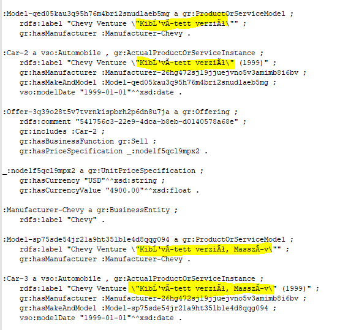
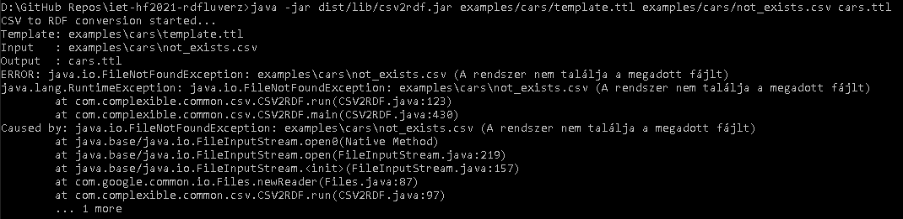
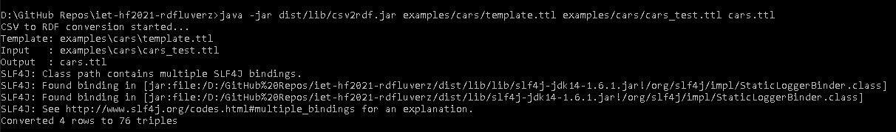
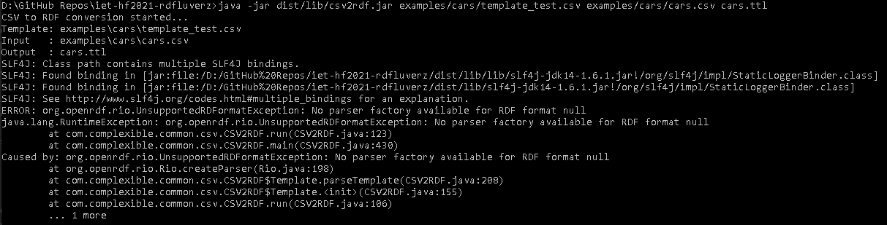
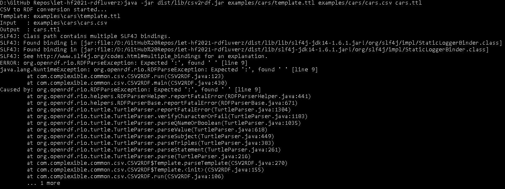
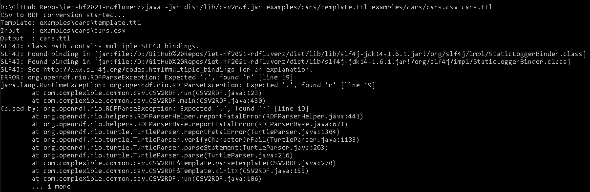
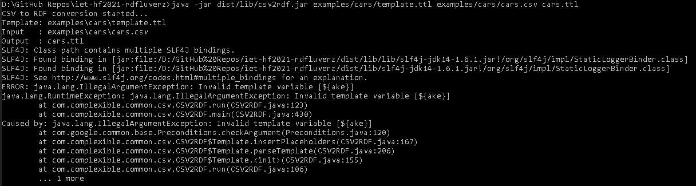
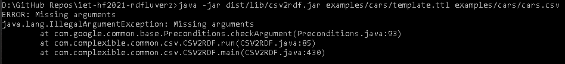
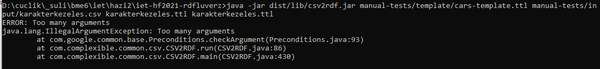

# Manuális tesztek

## Karakterkezelés teszt

Az input .csv fájlban ékezetes (á, é, ő, ű) betűk szerepelnek, a teszt célja megvizsgálni, hogy az alkalmazás ezeket megfelelően kezeli és az outputban is helyesen szerepelnek.

Az input file: `karakterkezeles.csv`

Kiadott parancs:

     java -jar dist/lib/csv2rdf.jar manual-tests/template/cars-template.ttl manual-tests/input/karakterkezeles.csv karakterkezeles.ttl

Az output fájl UTF-8 kódolású, de semmilyen ékezetes betűt nem tud kezelni:

## Üres input file teszt

A teszt célja hogy megvizsgálja, hogy akkor is lefut-e a program ha az input csv file üres.
Az alkalmazás helyesen kivételt dobott és jelezte, hogy üres az input file, .ttl file-t nem hozott létre

Input: `empty.csv`

Kiadott parancs: 

    java -jar dist/lib/csv2rdf.jar manual-tests/template/cars-template.ttl manual-tests/input/empty.csv empty.ttl

## Nemlétező input file teszt

A teszt célja hogy megvizsgálja, mi történik ha a megadott input file nem létezik. A problémát a beépített `Java.IO` észlelte és `File Not Found` kivételt dobott.
Maga a program nem ellenőrzi külön ezt az esetet. 

Kiadott parancs: 

    java -jar dist/lib/csv2rdf.jar examples/cars/template.ttl examples/cars/not_exists.csv cars.ttl

## Nemvárt input kiterjesztés (.ttl) teszt

A teszt célja, hogy megvizsgálja, hogy hogyan kezeli a program ha a megadott input-nak nem a várt formátuma van, esetünkben `.ttl`.
A programnak sikerült feldolgozni a nemvárt kiterjesztésű inputot és hiba nélkül létrehozta a `cars.ttl` kimenetet.

Kiadott parancs: 

    java -jar dist/lib/csv2rdf.jar examples/cars/template.ttl examples/cars/cars_test.ttl cars.ttl

## Nemvárt template kiterjesztés (.csv) teszt

A teszt célja, hogy megvizsgálja, hogy hogyan kezeli a program ha a megadott template-nek nem a várt formátuma van, esetünkben `.csv`.
A program nem tudta feldolgozni a nemvárt kiterjesztésű templatet és `Unsupported RDF Format` kivételt dobott.

Kiadott parancs: 

    java -jar dist/lib/csv2rdf.jar examples/cars/template_test.csv examples/cars/cars.csv cars.ttl

## Szintaktikailag hibás template file teszt

A teszt célja hogy megvizsgálja, mi történik ha a megadott template fileban szintaktiaki hiba van. Először egy comment elől vettem ki a `#` karaktert, másodjára egy deklarálás végéről vettem ki a `;` karaktert. Mindkét esetben az `OpenRDF.Rio` dobott `RDF Parse Exception` kivételt. A program nem kezeli külön a hibát.

Kiadott parancs: 

    java -jar dist/lib/csv2rdf.jar examples/cars/template.ttl examples/cars/cars.csv cars.ttl

## Hibás változónév a template file-ban teszt

A teszt célja hogy megvizsgálja, mi történik ha a megadott template fileban hibás egy változó neve: `{Make}` helyett `{ake}`.
A program észrevette a hibát és `Illegal Arguments` kivételt dobott.

Kiadott parancs: 

    java -jar dist/lib/csv2rdf.jar examples/cars/template.ttl examples/cars/cars.csv cars.ttl

## 3-nál kevesebb argumentum teszt

A teszt célja, hogy megvizsgálja, hogy hogyan kezeli a program ha túl kevés argumentumot ad meg a felhasználó.
A program tudta kezelni a helyzetet és `Missing arguments` kivételt dobott.

Kiadott parancs: 

    java -jar dist/lib/csv2rdf.jar examples/cars/template.ttl examples/cars/cars.csv

## 3-nál több argumentum teszt

A teszt célja, hogy megvizsgálja, hogy hogyan kezeli a program ha túl sok argumentumot ad meg a felhasználó
A program helyesen kezelte, Too many arguments kivételt dobott, nem jött létre .ttl file

Kiadott parancs: 

    java -jar dist/lib/csv2rdf.jar manual-tests/template/cars-template.ttl manual-tests/input/karakterkezeles.csv karakterkezeles.ttl karakterkezeles.ttl

## Escape karakter teszt
A programalapértelmezett escape karaktere a `/`, ezért ahelyett `#`-el teszteltük.
A program helyesen kezeli az escape karaktereket, két `#` volt egymás mellett az inputban, az outputban csak egy

Input: `escape.csv`

Kiadott parancs: 

    java -jar dist/lib/csv2rdf.jar manual-tests/template/cars-template.ttl manual-tests/input/escape.csv escape.ttl -e #

## Szeparátor karakter teszt

A programban az alapértelmezett szeparátor a csv input file-nál a `,` ezért `;`-t használtunk.
A program megfelelően kezelte az új szeparátor beállítást.

Input: `separator.csv`

Kiadott parancs:

    java -jar dist/lib/csv2rdf.jar manual-tests/template/cars-template.ttl manual-tests/input/separator.csv separator.ttl -s ;

## Quote karakter teszt
A program alapértelmezett quote karakter a `"` ezért, mi `!`-t használtunk, megfelelően kezelte.

Input: `quote.csv`

Kiadott parancs: 

     java -jar dist/lib/csv2rdf.jar manual-tests/template/cars-template.ttl manual-tests/input/quote.csv quote.ttl --quote !

