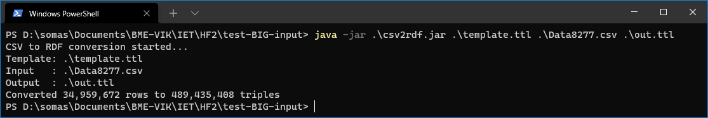
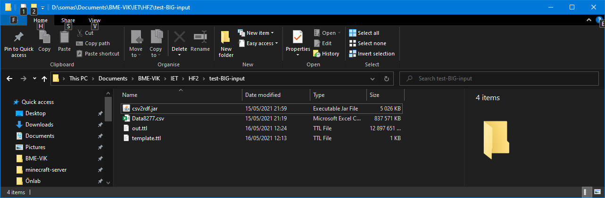
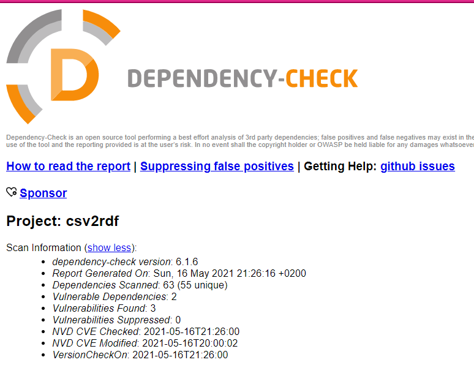
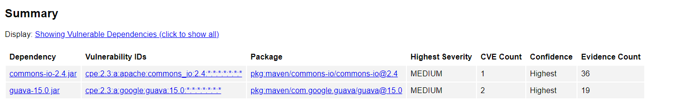

# Nemfunkcionális jellemzők vizsgálata

## Használhatóság

A vizsgálatok és tesztek során arra a megállapításra jutottunk, hogy a program használata nem bonyolult, viszont nem is kényelmes. A program parancssorból működik, így a különböző paraméterekkel való indítása viszonylag kényelmetlen. A futásához szükség van a template fájlra, aminek az előállítása szintén időigényes lehet, főleg egy bonyolultabb adatbázis esetében.

Az alkalmazás cserében jól automatizálható, ha sok, hasonló felépítésű .csv fájlt szeretnénk konvertálni. (Az oszlopok neveinek meg kell egyezni, de a sorrend eltérhet, ha a csv fejlécet tartalmaz).

## Stresszteszt nagyméretű fájllal

A program stressztesztje gyanánt egy többmillió soros .csv fájlt használtunk, aminek a konvertálása során nem ütközött problémába. Erre a magyarázat, hogy a program nem tárolja a memóriában sem a bemenet, sem a kimenet egészét, hanem a bemenetnek az aktuálisan feldolgozott sorát, a kimenetnek meg a nagyjából tempplat nagyságú eredményét. Az egyetlen fájl, amit a memóriában tárol teljes egészében a template.

A futás során a java környezet nagyjából 250MB memóriát használt, ez az érték az idő előrehaladtával jelentősen nem változott. A konverzió időtartama nagyjából 20 perc volt, de ez az érték a hardverkonfigurációtól, a használt templateben található kapcsolatok számától és egyéb változóktól is függ. 

A program futtatása és kimenete itt látható:

Ez pedig a futás mappájának tartalma:

A fájlokat méretük miatt githubra nem töltöttük föl.

## Biztonság viszgálata: 
Függőség viszgálatot végeztünk a DEPENDENCY CHECK eszköz használatával.
A vizsgálat elindítása parancssorból lehetséges a <em>dependency-check.sh --project "projekt neve" --scan "projekt könyvtár neve"</em> paranccsal. 
Az eredmény egy .html fájlba készül el, amely böngészőben megtekinthető. 
A projetünkre kapott vizsgálat eredményének rövid ősszefoglalása:
 
Látható, hogy 3 sérülékenység észlelhető a projektben. A sérülékenységek két függőség esetén jelennek meg. A többi függőség is kilistázásra kerül, de 0 sérülékenység detektálásával.  
A két sérülékenységet tartalmazó függőség: 
 

Mindkét sérülékenység közepes súlyosságú. 
### Az eslő függőség sérülékenysége: 
 Apache Commons IO -ben a 2.7.-es verzió előtt, amikor a  FileNameUtils.normalize metódust egy nem megfelelő string input-al hívjuk meg, az eredménnyel hozzáférhetünk a szülő mappához, hogyha azt felhasználjuk egy útvonal létrehozásához. 
 A sérülékenység forrásának útvonala: iet-hf2021-rdfluverz\dist\lib\lib\commons-io-2.4.jar
   
### Az mádodik függőség első sérülékenysége: 
A Google Guava 11.0-től  24.1.1-ig lehetőséget ad távoli támadóknak szerver oldali olyan szolgáltatások megtagadásra, amelyek ettől a könyvtártól függenek.  
### Az mádodik függőség második sérülékenysége: 
Létezik egy sérülékenység a Guava minden verziójában, amely egy esetleges lehetőséget ad a számítógéphez hozzáféréssel rendelkező támadóknak, hogy elérjenek adatokat egy ideiglenes mappában, amelyet a Guava Api `com.google.common.io.Files.createTempDir()` hoz létre. Alapértelmezetten az unix alapú rendszereken a létrehozott mappa bármilyen támadó által olvasható, akinek hozzáférése van a rendszerhez. 
 A sérülékenységek forrásának útvonala: iet-hf2021-rdfluverz\dist\lib\lib\guava-15.0.jar
  
[A riport (.html)](nonfunctional-img/dependency-check-report.html)

