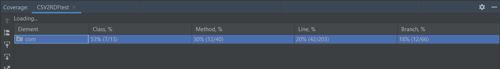

# Unit tesztelés JUnit5-el és kódlefedettség vizsgálata

A kiinduló projekt nem tartalmazott unit teszteket, ezért első lépésként a be kellet importálni a JUnit keretrendszert.

A kiinduló projekt egyetlen fájlból állt, a külső osztályban sok private láthatóságú belső osztály és függvény volt, ezért a tesztelhetőség miatt bizonyos metódusok és osztályok láthatóságát public-ra módosítottuk.

A következő teszteseteket valósítottuk meg:

## CSV2RDF toChar függvénye

A toChar függvényhez 2 tesztet készítettünk. Az első teszt megvizsgálja, hogy helyes paraméter esetén a függvény helyes ereményt ad-e. A teszt sikeresen lefutott, nem találtunk hibát.

A második teszt azt vizsgálja, hogy ha a függvény nem az elvártnak megfelelő paramétert kap (1 karakter helyett többet), akkor dob-e exception-t. A teszt sikeresen lefutott, nem találtunk hibát.

## CSV2RDF getParserConfig függvénye

A getParserConfig függvény hozza létre és állítja be a config-ot, a különböző beállítások ellenőrzéséhez 5 tesztet készítettünk, ezek mind sikeresen lefutottak, nem találtak hibát.

## RowNumberProvider provideValue függvénye

A RowNumeberProvider osztály egyetlen függvényből áll, ami paraméterként egy sor indexet és egy sort kap, visszatérési értéke az index string típusként. A teszt leellenőrzi, hogy a megadott indexet valóban string-ként adja-e vissza függvény. A teszt nem talált hibát.

## RowValueProvider provideValue függvénye

A RowValueProvider provideValue függvénye egy index alapján visszadaja a paraméterként kapott sorban és az index által jelölt oszlopban lévő elemet. A teszt leellenőrizte, hogy ez teljesül-e. A teszt nem talált hibát, sikeresen lefutott.

## UUIDProvider különböző sor indexekkel

Az <em>UUIDProvider</em> osztály egyetlen <em>provideValue</em> függvényét teszteljük. A függvény két bemeneti paraméterrel rendelkezik, egy sorszámmal és egy sor elemeivel. A függvény egy véletlenszerű azonosítot generál a sornak, ha még nem rendelkezik azonosítóval. A generált azonosító lesz a függvény visszatérési értéke. A <em>testUUIDProviderForDifferentRowIndexes</em> tesztfüggvény ellenőrzi, hogy két különböző sorszámú sor esetén, különböző azonosítót generál a  <em>provideValue</em> függvény. Az értékek véletszerű generálása helyes, a teszt nem talál hibát, sikeresen lefut.

## UUIDProvider egyező sor indexekkel

Szintén a  <em>UUIDProvider</em> osztály egyetlen <em>provideValue</em> függvényét teszteljük. A <em>testUUIDProviderForSameRowIndex</em> tesztfüggvény ellenőrzi, hogy ugyanazt a sorszámú sort megadva, a sornak nem generál új azonosítót a  <em>provideValue</em> függvény, hanem a függvény visszatérési értéke meg fog egyezni a már létező azonosító értékével. Nem generálódik új azonosító annak a sornak, amely már rendelkezik egy azonosítóval, a teszt nem talál hibát, sikeresen lefut.

## BNodeGenerator különböző sor indexekkel

A <em>BNodeGenerator</em> osztály egyetlen <em>generate</em> függvényét teszteljük. A függvény két bemeneti paraméterrel rendelkezik, egy sorszámmal és egy sor elemeivel. A megvalósítása során létrehoz egy BNode-ot a megadott sorszámú sorhoz, amennyiben még nem rendelkezik egyel. A létrehozott BNode lesz a függvény visszatérési értéke. A <em>testBNodeGeneratorForDifferentRowIndexes</em> tesztfüggvény ellenőrzi, hogy két különböző sorszámú sor esetén, különböző BNode-ot hoz létre a <em>generate</em> függvény. A BNode létrehozása és a megadott sorhoz való hozzáadása helyes, a teszt nem talál hibát, sikeresen lefut.

## BNodeGenerator egyező sor indexekkel

Szintén a <em>BNodeGenerator</em> osztály egyetlen <em>generate</em> függvényét teszteljük. A <em>testBNodeGeneratorForSameRowIndex</em> tesztfüggvény ellenőrzi, hogy két egyező sorszámú sor megadása esetén, a <em>generate</em> függvény csak első meghíváskor hoz létre egy új BNode-ot. A második meghívás esetén észleli, hogy a megadott sorszámú sor már rendelkezik BNode-al, nem hozza létre újra, hanem csak visszatér a már létező értékkel. A teszt nem talál hibát, sikeresen lefut.

 

# Kód lefedettségének tesztelése

A kód lefedettségének tesztelését a JaCoCo könyvtár segítségével végeztük el. A lefedettségi ellenőrzés a com.complexible.common.csv mappa teljes tartalmára történt. A csv mappa tartalmazza a projekt forráskódját. A projekt eredetileg nem rendelkezett teszteléssel, a lefedettség 0%-ról indult.  
A megvalósított egységtesztek az osztályok 53% százalékát fedik le. Azokat a függvényeket, amelyekben a különböző bemenő paraméterek hatására más eljárás valósul meg, több változatban teszteltük.

A lefedettségi teszt eredménye a megvalósított egységtesztek után:

